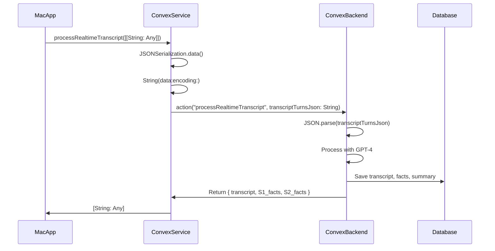

# Transcript Processing: JSON String Workaround

## Overview

This document explains the technical solution for sending transcript data from the Mac app to the shared Convex backend. The solution uses JSON string serialization to bypass Swift's type system limitations with protocol existentials.

## Problem Statement

### The Challenge

The Mac app needs to send transcript data to the backend action `processRealtimeTranscript`, which is shared between the Mac app and web app. The transcript data structure is:

```swift
[[String: Any]]  // Array of transcript turns, each with speaker, text, startTime, endTime
```

### Why the Standard Approach Failed

The ConvexMobile SDK expects arguments as `[String: (any ConvexEncodable)?]`. While arrays conform to `ConvexEncodable`, Swift's type system cannot cast nested arrays of protocol existentials:

```swift
// This fails at runtime - returns nil
let encodedTurns: [[String: (any ConvexEncodable)?]] = ...
let turnsAsAny = encodedTurns as [Any]
let turnsConverted = turnsAsAny as? (any ConvexEncodable)  // ❌ Returns nil
```

**Root Cause**: Swift's type system treats `[[String: (any ConvexEncodable)?]]` as a nested existential type that cannot be promoted to `(any ConvexEncodable)` at runtime, even though arrays technically conform to the protocol.

### Impact

When the cast failed, `nil` was sent to the backend instead of transcript data, causing:
- No transcript saved to database
- No fact extraction
- No knowledge graph updates
- Silent failure (no error thrown, just empty data)

## Solution: JSON String Serialization

### Architecture

Instead of trying to pass the array directly through the SDK's type system, we serialize it to a JSON string in Swift and send that string. The backend then parses the JSON string back into the expected array format.



### Implementation

#### Swift Side (Mac App)

**File**: `audora/Services/ConvexService.swift`

```swift
func processRealtimeTranscript(
    conversationId: String,
    transcriptTurns: [[String: Any]],
    initiatorName: String?
) async throws -> [String: Any] {
    guard let client = client else {
        throw ConvexError.clientNotInitialized
    }
    
    // Serialize transcript to JSON string to bypass Swift's ConvexEncodable type system limitations
    // This avoids the issue where [[String: (any ConvexEncodable)?]] cannot be cast to (any ConvexEncodable)
    guard let jsonData = try? JSONSerialization.data(withJSONObject: transcriptTurns, options: []),
          let jsonString = String(data: jsonData, encoding: .utf8) else {
        print("❌ Failed to serialize transcript to JSON")
        throw ConvexError.netError("Failed to serialize transcript")
    }
    
    // Build args with JSON string (backend will parse it)
    var args: [String: (any ConvexEncodable)?] = [:]
    args["conversationId"] = conversationId
    args["transcriptTurnsJson"] = jsonString  // Send as JSON string
    args["initiatorName"] = initiatorName ?? "Me"
    args["scannerName"] = "System"
    
    let response = try await client.action(
        "realtimeTranscription:processRealtimeTranscript",
        with: args
    ) as ProcessTranscriptResponse
    
    // Convert response to dictionary format
    // ...
}
```

**Key Points**:
- Uses `JSONSerialization.data()` to convert `[[String: Any]]` to `Data`
- Converts `Data` to `String` using UTF-8 encoding
- Sends as `transcriptTurnsJson` parameter (string type, which conforms to `ConvexEncodable`)
- No type casting issues - strings are straightforward `ConvexEncodable` types

#### Backend Side (TypeScript)

**File**: `packages/backend/convex/realtimeTranscription.ts`

```typescript
export const processRealtimeTranscript = action({
  args: {
    conversationId: v.id("conversations"),
    transcriptTurns: v.optional(
      v.array(
        v.object({
          speaker: v.string(),
          text: v.string(),
          startTime: v.number(),
          endTime: v.number(),
          words: v.optional(v.array(v.object({ /* ... */ }))),
        })
      )
    ),
    transcriptTurnsJson: v.optional(v.string()), // Add JSON alternative
    initiatorName: v.optional(v.string()),
    scannerName: v.optional(v.string()),
  },
  handler: async (ctx, args) => {
    let transcriptTurns: Array<{ /* ... */ }>;
    
    // Parse JSON if provided (Mac app), otherwise use array (web app)
    if (args.transcriptTurnsJson) {
      transcriptTurns = JSON.parse(args.transcriptTurnsJson);
      console.log(`Parsed ${transcriptTurns.length} conversation turns from JSON string`);
    } else if (args.transcriptTurns) {
      transcriptTurns = args.transcriptTurns;
      console.log(`Received ${transcriptTurns.length} conversation turns as array`);
    } else {
      throw new Error("No transcript data provided - must provide either transcriptTurns or transcriptTurnsJson");
    }
    
    // Rest of processing (GPT-4 fact extraction, database save, etc.)
    // ...
  }
});
```

**Key Points**:
- Both `transcriptTurns` (array) and `transcriptTurnsJson` (string) are optional
- Prioritizes JSON string if present (Mac app), falls back to array (web app)
- Uses `JSON.parse()` to deserialize the string back to array
- Same processing logic regardless of input format

## Backward Compatibility

### Web App (Unchanged)

The web app continues to use the original array format:

```typescript
// Web app code (unchanged)
const structuredTranscript = [
  {
    speaker: "S1",
    text: "Hello",
    startTime: 0,
    endTime: 500,
  },
  // ...
];

await convex.action("realtimeTranscription:processRealtimeTranscript", {
  conversationId,
  transcriptTurns: structuredTranscript,  // Array format
  initiatorName: "User",
  scannerName: "System",
});
```

The backend's fallback logic ensures the web app continues working without any changes.

### Mac App (New Format)

The Mac app uses JSON string format:

```swift
// Mac app code
let transcriptTurns: [[String: Any]] = [
  [
    "speaker": "S1",
    "text": "Hello",
    "startTime": 0.0,
    "endTime": 500.0,
  ],
  // ...
];

try await ConvexService.shared.processRealtimeTranscript(
  conversationId: conversationId,
  transcriptTurns: transcriptTurns,
  initiatorName: "Me"
);
```

Internally, `ConvexService` serializes this to JSON before sending.

## Timestamp Format

### Critical: Relative Timestamps, Not Unix Epoch

The backend expects timestamps as **milliseconds relative to recording start**, not Unix epoch milliseconds.

**Correct Implementation** (`RecordingSessionManager.swift`):

```swift
// Get recording start time (first chunk timestamp)
let recordingStartTime = meeting.transcriptChunks.first?.timestamp ?? Date()

// Format turns with RELATIVE timestamps in milliseconds
let transcriptTurns: [[String: Any]] = meeting.transcriptChunks.map { chunk in
    let relativeMs = chunk.timestamp.timeIntervalSince(recordingStartTime) * 1000
    return [
        "speaker": chunk.source == .mic ? "S1" : "S2",
        "text": chunk.text,
        "startTime": relativeMs,  // ✅ Relative milliseconds from recording start
        "endTime": relativeMs
    ]
}
```

**Example**:
- Recording starts at `2024-01-15 10:00:00`
- First chunk at `2024-01-15 10:00:02` → `startTime: 2000` (2 seconds = 2000ms)
- Second chunk at `2024-01-15 10:00:05` → `startTime: 5000` (5 seconds = 5000ms)

**Not**:
- ❌ `startTime: 1705312800000` (Unix epoch milliseconds)

## Data Flow

### Complete Flow

1. **Recording Stops** (`RecordingSessionManager.stopRecording()`)
   - Captures transcript chunks from `AudioManager`
   - Calculates relative timestamps
   - Formats as `[[String: Any]]`

2. **Backend Processing** (`ConvexService.processRealtimeTranscript()`)
   - Serializes array to JSON string
   - Sends to backend via `transcriptTurnsJson` parameter
   - Waits for response

3. **Backend Action** (`processRealtimeTranscript`)
   - Parses JSON string back to array
   - Extracts facts using GPT-4
   - Saves to database (transcript, facts, summary)
   - Updates Zep knowledge graph
   - Returns processed data

4. **Response Handling**
   - Converts response to `[String: Any]` dictionary
   - Returns to caller for optional display/logging

## Performance Considerations

### Overhead

- **Serialization**: `JSONSerialization.data()` - minimal overhead (~1-2ms for typical transcripts)
- **Deserialization**: `JSON.parse()` on backend - minimal overhead (~1-2ms)
- **Network**: JSON string is slightly larger than binary array, but negligible for transcript data

**Total overhead**: ~2-4ms per transcript processing, which is acceptable for a non-real-time operation.

### Optimization Opportunities

If this becomes a bottleneck (unlikely), consider:
1. Compression: Gzip the JSON string before sending
2. Binary format: Use MessagePack or similar binary serialization
3. SDK improvement: If ConvexMobile SDK adds better nested array support

## Future Considerations

### If ConvexMobile SDK Improves

If the SDK adds better support for nested protocol existential types, we could migrate back to direct array passing:

```swift
// Future (if SDK supports it)
args["transcriptTurns"] = transcriptTurns as? (any ConvexEncodable)
```

**Migration Strategy**:
1. Keep JSON string approach as fallback
2. Try direct array first, fall back to JSON if cast fails
3. Remove JSON approach once SDK fully supports it

### Alternative Solutions Considered

1. **Mac-specific backend function**: Rejected - defeats purpose of shared backend
2. **SDK overload with [String: Any]**: Not available in ConvexMobile SDK
3. **Custom ConvexEncodable wrapper**: Too complex, still has type issues
4. **JSON string (chosen)**: Simple, reliable, backward compatible

## Testing

### Verification Checklist

- ✅ Mac app sends transcript successfully
- ✅ Backend receives and parses JSON correctly
- ✅ Web app still works (uses array format)
- ✅ Database saves transcript, facts, summary correctly
- ✅ Timestamps are relative (not Unix epoch)
- ✅ Cross-platform data appears in same database

### Test Cases

1. **Mac app recording**: Verify transcript appears in database
2. **Web app recording**: Verify still works unchanged
3. **Resume recording**: Verify no duplicate data
4. **Empty transcript**: Verify graceful handling
5. **Large transcript**: Verify JSON serialization handles large arrays

## Related Files

- `audora/Services/ConvexService.swift` - JSON serialization implementation
- `audora/Managers/RecordingSessionManager.swift` - Relative timestamp calculation
- `packages/backend/convex/realtimeTranscription.ts` - Backend parsing logic
- `docs/app-flow.md` - System flow documentation

## Summary

The JSON string serialization approach solves a fundamental Swift type system limitation while maintaining backward compatibility with the web app. It's a clean, well-documented workaround that can be easily migrated away from if the SDK improves in the future.
